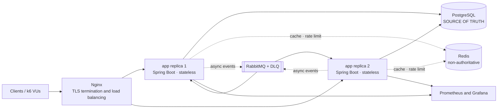
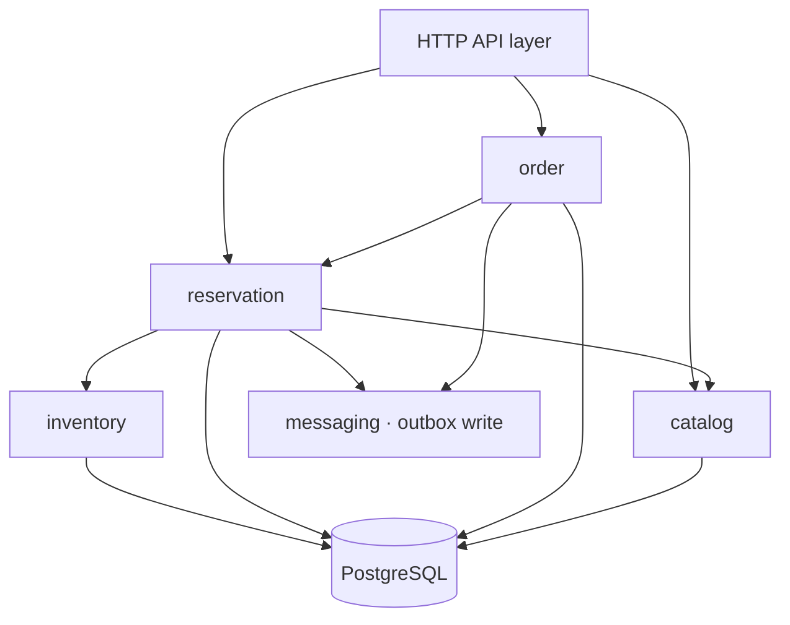
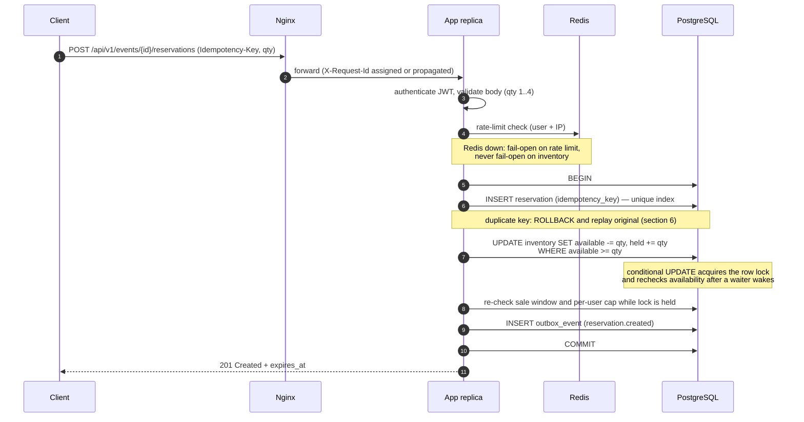
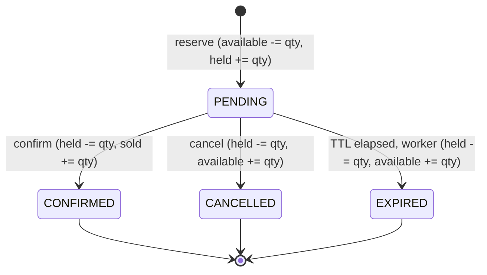
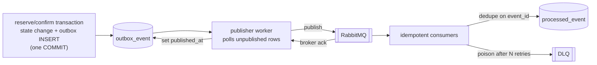

# Ticket Booking System — Architecture

| | |
|---|---|
| **Status** | Accepted — baseline for v1.0.0 |
| **Last updated** | 2026-09-05 (Week 2, Day 9) |
| **Owner** | Backend |
| **Related** | [slo.md](slo.md) · [failure-matrix.md](failure-matrix.md) · [ADR-001](adr/ADR-001-postgresql-inventory-authority.md) · [ADR-002](adr/ADR-002-pessimistic-locking.md) · [api/openapi.yaml](api/openapi.yaml) |

---

## 1. Purpose and engineering goal

This system sells general-admission tickets for events with a fixed inventory, under
flash-sale contention.

The primary engineering goal is **demonstrable correctness under contention**, not feature
breadth. An architecture is worthless here if 101 tickets can be sold from an inventory of
100. Every decision below is judged against one question: *does it make overselling
impossible, and can we prove it?*

The system therefore optimises, in strict priority order:

1. **Correctness** — inventory conservation and idempotency under any interleaving.
2. **Predictable failure** — dependencies fail fast and visibly, never silently or forever.
3. **Explainability** — behaviour is diagnosable from metrics and logs alone.
4. **Latency/throughput** — optimised only after 1-3 hold, and only where measured.

Quantified targets live in [slo.md](slo.md). Failure containment lives in
[failure-matrix.md](failure-matrix.md).

---

## 2. Architectural style: modular monolith

**One deployable Spring Boot application, internally partitioned into modules with enforced
boundaries, running as N stateless replicas against one PostgreSQL primary.**

Microservices were rejected for v1.0. Splitting `inventory` and `reservation` into separate
services converts a single ACID transaction into a distributed transaction, which is the
exact thing that would make overselling possible. Distribution would add network failure
modes, saga/compensation logic, and deployment overhead while *weakening* the core proof.

The module boundaries below are drawn so that a future extraction is a refactor, not a
rewrite — but extraction only happens when a measured bottleneck justifies it (see
[section 13](#13-scaling-strategy-and-known-limits)).

### 2.1 Deployment topology



**Solid edges are on the correctness path. Dotted edges must be survivable.** If Redis or
RabbitMQ is down, reservations must still be correct — degraded, slower, or louder, but
never oversold. This is enforced as an acceptance gate in
[failure-matrix.md](failure-matrix.md) (F-08, F-09).

Replicas hold **no session state**: no in-memory locks, no sticky sessions, no local
counters that affect a booking decision. Any request may be served by any replica; the only
shared mutable state is PostgreSQL. This is what makes "two replicas racing" a non-event
rather than a new class of bug.

---

## 3. Module boundaries

| Module | Responsibility | Owns tables | May be called by |
|---|---|---|---|
| `catalog` | Events, venues, show times, sale windows, public read models | `event` | `reservation`, API layer |
| `inventory` | Authoritative ticket counts; the lock/decrement path | `ticket_inventory` | `reservation` only |
| `reservation` | Hold lifecycle, TTL, per-user caps, idempotency | `reservation` | API layer, `order` |
| `order` | Confirmation flow and the (mock) payment boundary | `ticket_order` | API layer |
| `messaging` | Outbox publisher, RabbitMQ consumers, DLQ handling | `outbox_event`, `processed_event` | infrastructure only |
| `security` | JWT authentication, RBAC, request validation, rate limiting | — | cross-cutting filter chain |
| `observability` | Metrics, health indicators, correlation IDs | — | cross-cutting |

### 3.1 Dependency rules



Enforced rules — violations are review-blocking:

- **`inventory` is only ever mutated by `reservation`.** No controller, consumer, or admin
  path decrements `available` directly.
- **No module reads another module's tables.** Cross-module access goes through the owning
  module's service interface (`InventoryService`, `CatalogService`, ...).
- **No circular dependencies.** `inventory` knows nothing about reservations.
- **The outbox is written inside the caller's transaction**, never by a separate component
  after commit.
- Modules are Java packages `com.ticketsystem.<module>` with package-private internals; only
  types under `...<module>.api` are exported.

---

## 4. The reserve request path

This is the hot path and the only path where correctness is genuinely hard.



**The decisive property:** the conditional update is both the lock acquisition and the
availability decision, inside the same transaction. No availability value read beforehand
- from Redis, an earlier query, or another request - can authorise a decrement. The user cap
is evaluated while the update's row lock is still held. See
[ADR-002](adr/ADR-002-pessimistic-locking.md).

### 4.1 Confirm and cancel paths

Both follow the same shape: lock first, verify the current state, transition exactly once.

- **Confirm** (`POST /reservations/{id}/confirm`) — lock the reservation row, require
  `PENDING` and `expires_at > now()`, call the deterministic mock payment gateway, then in
  one transaction: `held -= qty`, `sold += qty`, reservation to `CONFIRMED`, insert the order
  (unique on `reservation_id`), write the outbox event.
- **Cancel** (`DELETE /reservations/{id}`) — lock the reservation row, require `PENDING`,
  then `held -= qty`, `available += qty`, reservation to `CANCELLED`.
- **Expire** (background worker) — batch-select expired `PENDING` holds with
  `FOR UPDATE SKIP LOCKED`, releasing each exactly once. `SKIP LOCKED` is what lets several
  replicas run the worker concurrently without double-releasing (F-05).

Cancel and expire race by design. The row lock plus the `status = 'PENDING'` guard means
whichever transaction commits first wins; the loser observes a non-`PENDING` status and
becomes a no-op. Inventory is returned exactly once, satisfying **I4**.

---

## 5. Data model and invariants

### 5.1 Business invariants

These are the contract. Every design decision traces to one of them.

| ID | Invariant | Enforced by |
|---|---|---|
| **I1** | `available >= 0` — no overselling under any interleaving | conditional atomic update + `CHECK` constraint |
| **I2** | `available + held + sold = total` — inventory conservation | single-transaction counter moves + `CHECK` constraint |
| **I3** | One idempotency key produces one logical reservation | `UNIQUE` index in PostgreSQL |
| **I4** | A hold is released at most once | row lock + status guard on transition |
| **I5** | Confirmation consumes the same hold exactly once | status guard + `UNIQUE(reservation_id)` on `ticket_order` |
| **I6** | Per-user/event purchase cap enforced inside the transaction | counted after the lock is held |

Invariants are checked three ways: database constraints (cannot be bypassed), service-layer
guards (produce good error messages), and a post-test reconciliation query (proves it
actually held under load).

### 5.2 Tables

| Table | Key fields | Purpose |
|---|---|---|
| `event` | `id`, `name`, `venue`, `sale_starts_at`, `sale_ends_at`, `status` | Catalog and sale window |
| `ticket_inventory` | `event_id` PK/FK, `total`, `available`, `held`, `sold`, `updated_at` | One hot row per event — the lock target |
| `reservation` | `id` UUID, `event_id`, `user_id`, `qty`, `status`, `expires_at`, `terminated_at`, `idempotency_key` UNIQUE, `request_fingerprint` | Hold state + retry identity |
| `ticket_order` | `id`, `reservation_id` UNIQUE, `status`, `amount_minor`, `created_at` | Confirmation / payment boundary |
| `outbox_event` | `id`, `aggregate_id`, `type`, `payload`, `created_at`, `published_at` | Reliable event publication |
| `processed_event` | `event_id` PK, `consumer`, `processed_at` | Consumer-side dedupe |

The order table is named `ticket_order`, not `order`: `ORDER` is a reserved word in the SQL
standard, so an unquoted `order` table is invalid and a quoted `"order"` forces quoting at
every use site, in every tool, forever.

Deliberate choice: **one inventory row per event**, not per seat. General admission is
sufficient to prove the concurrency model, and it deliberately creates the worst case —
maximum contention on a single row — which is exactly the case worth proving. Seat-level
inventory is a post-v1.0 stretch goal.

`ticket_inventory` carries a `version` column for observability and optimistic-locking
experiments, but v1.0 does **not** rely on it for correctness (see
[ADR-002](adr/ADR-002-pessimistic-locking.md)).

### 5.3 Reservation state machine



| From | To | Trigger | Inventory effect | Guard |
|---|---|---|---|---|
| — | `PENDING` | reserve | `available -= qty`, `held += qty` | sale open, `qty` valid, cap not exceeded, `available >= qty` |
| `PENDING` | `CONFIRMED` | confirm | `held -= qty`, `sold += qty` | not expired, payment authorised |
| `PENDING` | `CANCELLED` | cancel | `held -= qty`, `available += qty` | caller owns reservation |
| `PENDING` | `EXPIRED` | expiry worker | `held -= qty`, `available += qty` | `expires_at <= now()` |

`expires_at` is assigned at creation and **retained after termination** for audit; a
`CHECK` constraint pairs it with `terminated_at`, so a `PENDING` hold always has a deadline
and no termination time, and a terminal hold always has both. A half-applied transition -
status moved, timestamp not - cannot be committed.

`CONFIRMED`, `CANCELLED`, and `EXPIRED` are **terminal**. There are no other edges — a
transition attempt from a terminal state is rejected with `409 INVALID_STATE`, never
silently ignored, so retries stay observable rather than invisible.

Transitions are implemented as service methods (`confirm()`, `cancel()`, `expire()`) that
encapsulate the lock, the guard, and the counter move. **The entity exposes no public status
setter** — that is the mechanism preventing a future contributor from half-applying a
transition.

---

## 6. Idempotency design

`POST /events/{id}/reservations` **requires** an `Idempotency-Key` header. The key is stored
in a `UNIQUE` column on `reservation`, so uniqueness is enforced by PostgreSQL, not by
application memory — an in-JVM cache would break the moment a second replica exists.

Duplicate handling, in order:

1. The insert carrying a duplicate key **blocks** on the unique index until the first
   transaction resolves — PostgreSQL gives this for free.
2. If the first transaction committed, the duplicate insert fails with a unique violation.
   The application rolls back, re-reads the original reservation by key, and returns the
   **original result** with `Idempotency-Replayed: true`. No second hold is created.
3. If the first transaction rolled back, the duplicate insert succeeds and becomes the
   winner. Exactly one hold either way.
4. If the wait exceeds `lock_timeout`, the client gets `409 IDEMPOTENCY_IN_PROGRESS` with
   `Retry-After` — a safe, retryable answer rather than a hung connection.

A replay returns the **same HTTP status as the original response** (so `201` stays `201`),
distinguished only by the `Idempotency-Replayed` header. Reusing one key with a *different*
request body is a client bug and is rejected with `409 IDEMPOTENCY_KEY_CONFLICT`; a stored
request fingerprint makes this detectable.

This is what makes the "client timed out but the write committed" case safe: the client
retries with the same key and learns the true outcome (F-02).

---

## 7. Consistency and caching rules

**PostgreSQL is the sole authority for inventory.** See
[ADR-001](adr/ADR-001-postgresql-inventory-authority.md).

| Data | Source of truth | Cacheable in Redis | Rule |
|---|---|---|---|
| Event catalog / details | PostgreSQL | Yes, TTL 60 s | Invalidate on admin update |
| Displayed availability | PostgreSQL | Yes, TTL 5 s | **Advisory only** — flagged `advisory: true` in the response, never used to authorise a decrement |
| Actual inventory counters | PostgreSQL | **Never** | Read under `FOR UPDATE` inside the reserve transaction |
| Rate-limit counters | Redis | n/a | Loss degrades protection, not correctness |
| Reservation / order state | PostgreSQL | Never | — |

A Redis cache miss, restart, eviction, or stale value must be able to cost a slow page or a
slightly wrong number on a screen — never a ticket. Stale availability shown to a user is
acceptable; stale availability trusted at commit time is not.

---

## 8. Asynchronous work: transactional outbox

Everything not required for the booking decision is asynchronous: notifications, analytics,
audit. None of it may be published from inside the booking transaction, because a database
commit and a broker publish cannot be made atomic.



Rules: the outbox row is written in the same transaction as the state change; rows are
marked published **only after broker acknowledgement**; consumers dedupe on `event_id`
against `processed_event`; retries use bounded exponential backoff and land in a DLQ.

This yields **at-least-once delivery with idempotent consumption**, which is observationally
exactly-once. A broker outage delays events; it never loses them and never blocks a booking
(F-08).

---

## 9. API contract

Full machine-readable contract: [api/openapi.yaml](api/openapi.yaml).

| Method | Path | Purpose | Auth | Idempotency |
|---|---|---|---|---|
| `POST` | `/api/v1/events/{eventId}/reservations` | Create a hold | USER | `Idempotency-Key` **required** |
| `POST` | `/api/v1/reservations/{reservationId}/confirm` | Confirm and pay | USER (owner) | Naturally idempotent via state guard |
| `DELETE` | `/api/v1/reservations/{reservationId}` | Cancel a hold | USER (owner) | Naturally idempotent via state guard |
| `GET` | `/api/v1/reservations/{reservationId}` | Read hold state | USER (owner) | — |
| `GET` | `/api/v1/events`, `/api/v1/events/{eventId}` | Catalog (cached) | Public | — |
| `GET` | `/api/v1/events/{eventId}/availability` | **Advisory** availability | Public | — |
| `POST` | `/api/v1/admin/events`, `PATCH /api/v1/admin/events/{eventId}` | Manage catalog | ADMIN | — |

### 9.1 Error contract

All errors use RFC 9457 `application/problem+json` with a stable machine-readable `code`, so
clients and load tests can branch on domain outcome without parsing prose:

```json
{
  "type": "https://ticketsystem.dev/problems/sold-out",
  "title": "Sold out",
  "status": 409,
  "detail": "Event 7f3a... has no remaining tickets.",
  "code": "SOLD_OUT",
  "traceId": "0f9c2b1e-4c1a-4a9e-9f0a-9b2c3d4e5f60"
}
```

| Code | HTTP | Meaning |
|---|---|---|
| `VALIDATION_ERROR` | 400 | Malformed body or parameter |
| `INVALID_QUANTITY` | 400 | Quantity outside 1..4 |
| `IDEMPOTENCY_KEY_REQUIRED` | 400 | Header missing on reserve |
| `UNAUTHORIZED` / `FORBIDDEN` | 401 / 403 | Missing or invalid token; wrong role or not the owner |
| `EVENT_NOT_FOUND` / `RESERVATION_NOT_FOUND` | 404 | Unknown resource |
| `SALE_NOT_STARTED` / `SALE_ENDED` | 409 | Outside the sale window |
| `SOLD_OUT` | 409 | Insufficient inventory at commit time |
| `USER_LIMIT_EXCEEDED` | 409 | Per-user/event cap would be exceeded |
| `RESERVATION_EXPIRED` | 409 | Hold TTL elapsed before confirm |
| `INVALID_STATE` | 409 | Transition not legal from the current state |
| `IDEMPOTENCY_KEY_CONFLICT` | 409 | Key reused with a different payload |
| `IDEMPOTENCY_IN_PROGRESS` | 409 | Identical request still in flight; retry |
| `PAYMENT_DECLINED` | 402 | Mock gateway declined |
| `DEPENDENCY_TIMEOUT` | 504 | A bounded remote call exceeded its deadline; no blind purchase retry |
| `RATE_LIMITED` | 429 | Too many attempts (`Retry-After` set) |
| `INTERNAL_ERROR` | 500 | Unexpected — always paired with a logged `traceId` |

**Domain rejections are 4xx, not 5xx.** A sold-out flash sale must produce a fast, cheap,
correct `409 SOLD_OUT` — not a 5xx storm. The load tests assert this distinction, and the
SLO error budget counts only 5xx (see [slo.md](slo.md)).

---

## 10. Security

- **JWT bearer authentication**, roles `USER` and `ADMIN`; the app is stateless, so no
  server-side session store is needed for replicas to be interchangeable.
- **Ownership checks** on every reservation operation — a valid token for user A must not
  cancel user B's hold.
- **Validation at the boundary**: quantity bounds, body size limits, UUID format, and a
  bounded `Idempotency-Key` length, so hostile input is rejected before it reaches the lock.
- **Rate limiting** in Redis, per user and per IP, on reserve attempts. `429 RATE_LIMITED`
  is kept strictly distinct from `409 SOLD_OUT` — conflating them would hide a real
  availability signal behind a throttling signal.
- **Secrets** (DB, JWT signing key, broker credentials) are injected via environment or
  secret store; never committed, never baked into the image.

---

## 11. Observability

Every path above is instrumented so a failed load test is diagnosable from dashboards and
logs, without attaching a debugger.

- **Business metrics** — reservation attempts, successes, sold-out outcomes, idempotency
  hits, confirmation success/failure, expired holds, and expiry failures. Failure reasons use
  the bounded domain error-code set; IDs never become labels.
- **Latency histograms** — reserve transaction, confirmation including bounded payment, and
  expiry worker batch, all measured through transaction completion so p95/p99 reflect commit.
- **Infrastructure** — JVM, HikariCP pool saturation, HTTP server, RabbitMQ queue depth and
  DLQ size, outbox backlog age.
- **Health** — `/actuator/health/liveness` and `/actuator/health/readiness`. Readiness fails
  when the app cannot safely serve traffic (for example no database), so the load balancer
  removes the replica; liveness stays up so the orchestrator does not pointlessly restart a
  process that is merely waiting on a dependency.
- **Correlation** — an `X-Request-Id` is accepted or generated at the edge, placed in MDC,
  attached to Logstash JSON records, and propagated onto outbox events. Publisher and consumer
  scopes restore that id during asynchronous processing.

The implemented dashboard, rules, metric names, and diagnostic drill are recorded in the
[Day 10 observability runbook](day10-observability.md).

---

## 12. Configuration defaults

Concrete starting values, so later days measure a defined system rather than a moving
target. All are externalised as configuration.

| Setting | Default | Rationale |
|---|---|---|
| Hold TTL | 3 min | Long enough to pay, short enough to recycle inventory in a flash sale |
| Max quantity per request | 4 | Bounds the blast radius of one hostile request |
| Per-user cap per event | 4 tickets | Business rule; enforced post-lock (**I6**) |
| Expiry worker interval / batch | 10 s / 200 rows | Bounded work per tick; `SKIP LOCKED` allows parallel workers |
| Outbox publisher interval / batch | 1 s / 100 rows | Keeps publish lag well inside the SLO |
| PostgreSQL `lock_timeout` | 2 s | Fail fast under contention instead of queueing forever |
| PostgreSQL `statement_timeout` | 3 s | Nothing on the hot path should ever run this long |
| HikariCP pool | 8 per replica | Two replicas consume at most 16/50 local PostgreSQL connections, leaving operational headroom |
| Rate limit | 10 reserve/min/user, 60/min/IP | Protects the hot row from trivial abuse |
| Catalog cache TTL | 60 s (5 s for advisory availability) | Stale display is acceptable; stale commit data is not |

---

## 13. Scaling strategy and known limits

**Known limit, stated up front:** all reservations for one event serialise on a single
`ticket_inventory` row. Throughput for one hot event is bounded by how fast PostgreSQL can
process that serialised critical section — roughly `1 / (lock hold time)`. Keeping the
locked section short (no network calls, no payment, no broker publish inside the lock) is
therefore the single most important performance rule in the codebase.

Scaling steps and their Day 9 state:

1. **Complete:** two stateless replicas behind Nginx preserve correctness (F-11).
2. **Complete:** Hikari is bounded at 8 per replica against 50 PostgreSQL connections.
3. **Complete:** the conditional atomic `UPDATE ... WHERE available >= qty` won the
   head-to-head comparison and is now the default; see the
   [Day 9 report](day9-scaling-benchmark.md).
4. If later measurements justify it, split hot inventory into N sub-buckets per event - accepting
   the added complexity of routing and rebalancing.
5. Read replicas for catalog traffic; a virtual waiting room for extreme spikes.

Explicitly **not** in v1.0: microservices, Kubernetes, Kafka or event sourcing, seat-level
inventory, real payment integration, distributed tracing infrastructure.

---

## 14. Acceptance gate for Day 1

This document, together with [failure-matrix.md](failure-matrix.md), satisfies the Day 1
gate: **every listed failure case is contained by a named mechanism, and the containment can
be explained before any implementation code is written.** Each row of the failure matrix
names the mechanism, the expected observable behaviour, and the test that will prove it.
