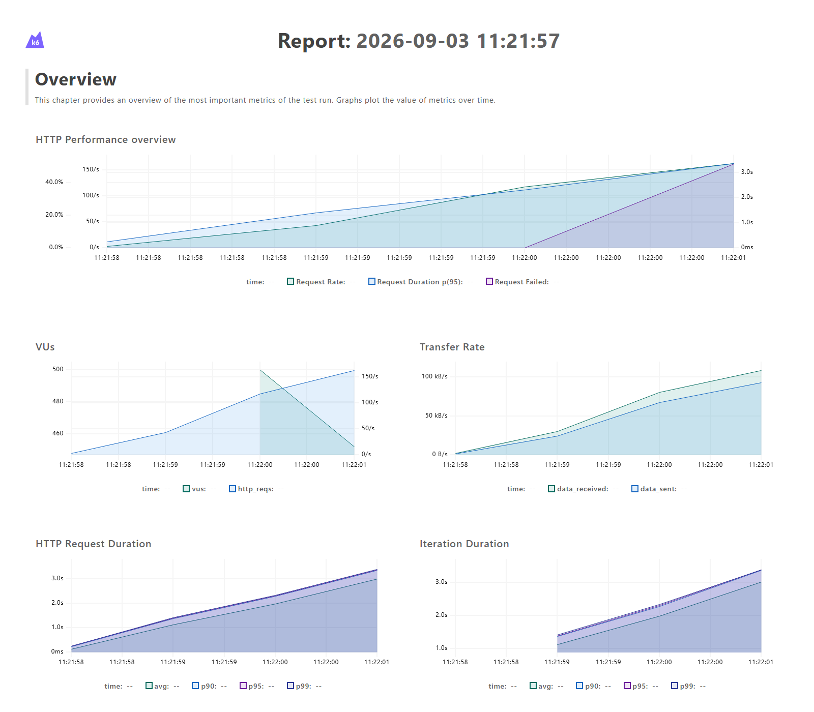

# Day 6 - k6 baseline and contention analysis

> Day 9's two-replica before/after benchmark and the adopted atomic-update decision are
> recorded in [`docs/day9-scaling-benchmark.md`](../docs/day9-scaling-benchmark.md).
> Day 10's dashboard-backed 200-user diagnostic drill is recorded in
> [`docs/day10-observability.md`](../docs/day10-observability.md).

**Run:** `20260903-local5`  
**Result:** Inventory correctness passed in all four scenarios. The 500-VU latency and
availability targets failed, with measured Hikari saturation and PostgreSQL lock contention.

## Environment

| Property | Measured value |
|---|---|
| Host | Windows 10.0.26200, AMD Ryzen 5 7535HS, 12 logical processors, 15.21 GiB RAM, SSD |
| Runtime | Java 21.0.11, Spring Boot 4.1.1 |
| Load generator | k6 2.1.0, separate host process |
| Dependencies | PostgreSQL 16.14 and Redis 7.4.8 in Docker 29.5.3 |
| Topology | One Spring Boot process, one PostgreSQL primary, one Redis instance |
| Hikari | Maximum pool size 20, connection timeout 3 seconds |
| Fixture | A new event created through the admin API for each scenario |
| Isolation | `load` profile; rate limiter and automatic expiry disabled |

This Week 1 run intentionally measures the current single-process implementation. It does
**not** match the two-replica reference topology in `docs/slo.md`; multi-replica comparison
is the Day 9 deliverable. The load generator shared the same physical host, so these numbers
are a local baseline and must not be presented as production capacity.

## Scenario results

All latency values below are client-side milliseconds. Throughput is completed scenario
iterations per second. Setup requests are excluded from the custom reserve latency metric.

| Scenario | Reserve attempts | Created | Replayed | `SOLD_OUT` | Server/connection faults | Cancelled | p50 | p95 | p99 | Iterations/s |
|---|---:|---:|---:|---:|---:|---:|---:|---:|---:|---:|
| 100 tickets / 500 VUs | 500 | 100 | 0 | 172 | 228 | 0 | 3,173.31 | 3,711.05 | 3,803.61 | 116.17 |
| Duplicate retries | 25 | 1 | 24 | 0 | 0 | 0 | 119.97 | 127.46 | 128.34 | 101.84 |
| Mixed reserve/cancel | 100 | 100 | 0 | 0 | 0 | 50 | 778.69 | 1,521.13 | 1,644.93 | 55.99 |
| Already sold-out / 500 VUs | 500 | 0 | 0 | 108 | 392 | 0 | 0.00* | 595.44 | 676.74 | 546.82 |

`*` The sold-out p50 is zero because 392 TCP connections were refused immediately. The 108
requests that reached the application returned the correct `SOLD_OUT` domain code; their
HTTP p95 was 673.56 ms. A fast connection refusal is not a successful low-latency response.

The mixed scenario's 50 cancel calls recorded p50 474.84 ms, p95 969.90 ms, and p99
1,007.00 ms.

## Correctness evidence

The runner queries `v_inventory_reconciliation` after every scenario and fails on a negative
counter, conservation drift, held-ledger drift, or sold-ledger drift.

| Scenario | Total | Available | Held | Sold | Reservation rows | Cancelled rows | Conservation / held / sold drift |
|---|---:|---:|---:|---:|---:|---:|---|
| 100 tickets / 500 VUs | 100 | 0 | 100 | 0 | 100 | 0 | `0 / 0 / 0` |
| Duplicate retries | 100 | 99 | 1 | 0 | 1 | 0 | `0 / 0 / 0` |
| Mixed reserve/cancel | 100 | 50 | 50 | 0 | 100 | 50 | `0 / 0 / 0` |
| Already sold-out / 500 VUs | 5 | 0 | 5 | 0 | 2 | 0 | `0 / 0 / 0` |

The acceptance gate passed: the 500-VU fixture admitted exactly 100 valid holds from 100
tickets, no counter became negative, and every ledger drift remained zero. Duplicate retries
also produced one database reservation and 24 stable replays.

## Contention evidence

| Scenario | Hikari active / max | Peak Hikari pending | Peak PostgreSQL active | Peak PostgreSQL lock waiters |
|---|---:|---:|---:|---:|
| 100 tickets / 500 VUs | 20 / 20 | 429 | 18 | 17 |
| Duplicate retries | 0 / 20 | 0 | 1 | 0 |
| Mixed reserve/cancel | 20 / 20 | 66 | 19 | 18 |
| Already sold-out / 500 VUs | 20 / 20 | 75 | 1 | 0 |

### Measured bottleneck

The baseline misses the reserve target of p95 <= 300 ms by more than 12x. The primary
measured cause is the serialized hot inventory row: 17 PostgreSQL sessions were observed
waiting on locks while all 20 Hikari connections were active. That caused 429 callers to
queue for a connection, and 228 exceeded the intentional three-second pool timeout and
returned server faults. Increasing the pool without changing the lock path would add more
database waiters, not remove the serialized critical section.

The mixed scenario shows the same shape at lower concurrency: 18 lock waiters, all 20 pool
connections active, and 66 pending callers. Correctness remained intact, but reserve and
cancel p95 both missed their targets.

The pre-sold-out spike exposed a separate burst-handling problem. PostgreSQL reported no
lock queue in the captured sample, but the pool was full with 75 pending and 392 clients saw
immediate connection refusal at the single local application listener. This fails the
availability objective even though the database state stayed correct.

Day 9 should compare the current path against conditional atomic inventory decrement, then
repeat at 500/1,000/2,000 VUs with two replicas. It should also measure the HTTP accept queue
separately before changing connector or Hikari limits.

## Visual evidence



The self-contained interactive report is in
[`baseline-dashboard.html`](results/20260903-local5/baseline-dashboard.html). Raw k6
summaries, console output, pool/lock samples, and reconciliation JSON are retained alongside
it in [`results/20260903-local5`](results/20260903-local5/).

## Reproduce

Prerequisites: Java 21, Maven, Docker Desktop, and k6 on `PATH`.

```powershell
.\load-tests\run-day6.ps1
```

The runner creates isolated PostgreSQL/Redis containers, builds and starts the application,
runs all four scenarios, verifies authoritative database state, records machine details, and
removes the containers and load-only JVM afterward. A new timestamped result directory is
created for every run.
